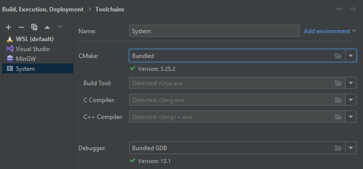

[Return](../README.md)

# Build

## CLion

- Go to `File` -> `Settings` -> `Build, Execution, Deployment` -> `Toolchains` -> `+` -> `System`

1. Go to `File` -> `Settings` -> `Build, Execution, Deployment` -> `CMake` -> add a new profile with the toolchain you just created named `Debug`
2. Set `CMake options` to `-DCMAKE_TOOLCHAIN_FILE=<path to vcpkg>/scripts/buildsystems/vcpkg.cmake`

- Go to `CMakeLists.txt` and reload it